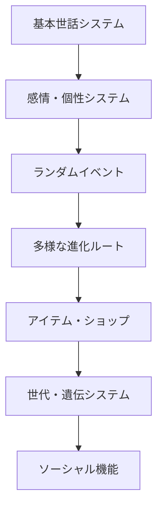
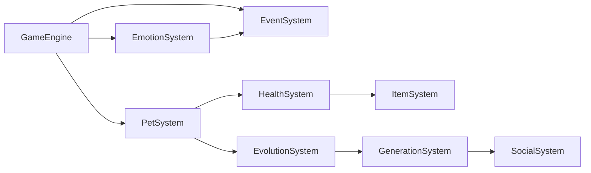
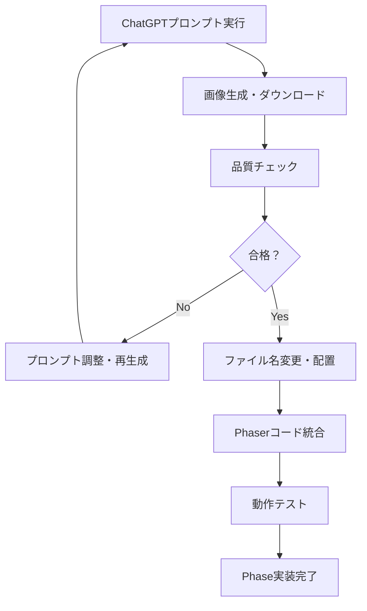

# ミタマっち – 拡張版詳細設計書 v2.0

> **Version**: 2.0 | 2025-07-14
> 
> **対象 PRD**: «ミタマっち – Product Requirements Document (PRD) v0.1»
> 
> **目的**: 本格的なたまごっちライクゲームとして、愛着・個性・継続性を重視した体験設計の実現

---

## 目次

1. [システム概要](#システム概要)
2. [アーキテクチャ設計](#アーキテクチャ設計)
3. [データモデル設計](#データモデル設計)
4. [機能設計](#機能設計)
5. [ビジュアル設計](#ビジュアル設計)
6. [UI/UX設計](#uiux設計)
7. [オーディオ設計](#オーディオ設計)
8. [イベントシステム設計](#イベントシステム設計)
9. [段階的実装プラン](#段階的実装プラン)
10. [技術仕様](#技術仕様)

---

## 1. システム概要

### 1.1 設計方針

| 項目 | 方針 | 具体例 |
|------|------|--------|
| **愛着形成** | 個性・命名・成長履歴による感情的結びつき | 名前付け、個性システム、成長記録 |
| **予期せぬ楽しさ** | ランダムイベント・多様な反応 | いたずらイベント、気分による反応変化 |
| **長期継続性** | 世代システム・コレクション要素 | 家系図、遺伝システム、レアな進化 |
| **戦略性** | 世話方法による結果の分岐 | 進化ルート、病気予防、ステータス管理 |

### 1.2 拡張機能概要



---

## 2. アーキテクチャ設計

### 2.1 モジュール構成

```
src/
├── core/
│   ├── GameEngine.ts           # ゲームエンジン統合
│   ├── SaveDataManager.ts      # 拡張されたセーブデータ管理
│   └── ConfigManager.ts        # ゲーム設定管理
├── systems/
│   ├── PetSystem.ts           # ペット基本管理
│   ├── EmotionSystem.ts       # 感情・個性システム
│   ├── EventSystem.ts         # ランダムイベント管理
│   ├── HealthSystem.ts        # 健康・病気システム
│   ├── EvolutionSystem.ts     # 進化システム
│   ├── ItemSystem.ts          # アイテム・ショップ
│   ├── GenerationSystem.ts    # 世代・遺伝システム
│   └── SocialSystem.ts        # ソーシャル機能
├── entities/
│   ├── Pet.ts                 # ペットエンティティ
│   ├── Item.ts                # アイテムエンティティ
│   ├── Event.ts               # イベントエンティティ
│   └── Generation.ts          # 世代エンティティ
├── ui/
│   ├── screens/               # 画面コンポーネント
│   ├── components/            # UIコンポーネント
│   └── managers/              # UI管理
└── utils/
    ├── RandomUtils.ts         # ランダム処理
    ├── TimeUtils.ts           # 時間計算
    └── ValidationUtils.ts     # データ検証
```

### 2.2 システム依存関係



---

## 3. データモデル設計

### 3.1 拡張ペットデータ

```typescript
interface ExtendedPet {
  // 基本情報
  id: string;
  name: string;                    // ユーザー命名
  birthTime: number;               // 誕生時刻
  phase: PetPhase;
  generation: number;              // 第何世代
  
  // ステータス
  status: PetStatus;               // 基本ステータス
  emotion: EmotionalState;         // 感情状態
  health: HealthState;             // 健康状態
  personality: PersonalityTraits;  // 個性
  
  // 履歴・統計
  careHistory: CareRecord[];       // 世話履歴
  evolutionPath: EvolutionRecord[]; // 進化履歴
  achievements: Achievement[];      // 達成項目
  
  // 関係性
  parents?: [string, string];      // 両親のID
  children: string[];              // 子のID
  friendships: Friendship[];       // 友好関係
}
```

### 3.2 感情・個性システム

```typescript
interface EmotionalState {
  happiness: number;        // 幸福度 (0-100)
  energy: number;          // 元気度 (0-100)
  stress: number;          // ストレス度 (0-100)
  affection: number;       // 愛情度 (0-100)
  lastInteractionTime: number;
  currentMood: MoodType;
}

type MoodType = 'cheerful' | 'normal' | 'sad' | 'excited' | 'tired' | 'sick';

interface PersonalityTraits {
  type: PersonalityType;
  traits: {
    sociability: number;    // 社交性 (0-100)
    activity: number;       // 活発性 (0-100)
    curiosity: number;      // 好奇心 (0-100)
    stubbornness: number;   // 頑固さ (0-100)
  };
  preferences: {
    favoriteFood: FoodType[];
    favoriteActivity: ActivityType[];
    preferredTime: TimeOfDay;
  };
}

type PersonalityType = 'active' | 'calm' | 'playful' | 'shy' | 'curious' | 'stubborn';
```

### 3.3 健康・病気システム

```typescript
interface HealthState {
  overall: number;          // 総合健康度 (0-100)
  immunity: number;         // 免疫力 (0-100)
  currentIllness?: Illness;
  illnessHistory: IllnessRecord[];
  lastCheckup: number;
}

interface Illness {
  type: IllnessType;
  severity: Severity;
  duration: number;
  symptoms: Symptom[];
  treatment: Treatment[];
}

type IllnessType = 'cold' | 'stomachache' | 'fatigue' | 'depression' | 'fever';
type Severity = 'mild' | 'moderate' | 'severe';
```

### 3.4 アイテムシステム

```typescript
interface Item {
  id: string;
  name: string;
  type: ItemType;
  rarity: Rarity;
  description: string;
  effects: ItemEffect[];
  price: number;
  unlockCondition?: UnlockCondition;
}

type ItemType = 'food' | 'toy' | 'medicine' | 'decoration' | 'accessory';
type Rarity = 'common' | 'rare' | 'epic' | 'legendary';

interface ItemEffect {
  target: EffectTarget;
  type: EffectType;
  value: number;
  duration?: number;
}

interface PlayerInventory {
  items: InventoryItem[];
  currency: number;         // ソウル
  capacity: number;
}
```

### 3.5 イベントシステム

```typescript
interface GameEvent {
  id: string;
  type: EventType;
  trigger: EventTrigger;
  probability: number;
  conditions: EventCondition[];
  outcomes: EventOutcome[];
  cooldown?: number;
}

type EventType = 'random' | 'scheduled' | 'conditional' | 'crisis';
type EventTrigger = 'time' | 'action' | 'status' | 'random';

interface EventOutcome {
  message: string;
  effects: StatusEffect[];
  rewards?: Reward[];
  nextEvents?: string[];
}
```

---

## 4. 機能設計

### 4.1 Phase A: 即効性改善 (1-2週間)

#### 4.1.1 命名システム
```typescript
class NamingSystem {
  // 名前付け時の処理
  namePet(petId: string, name: string): boolean {
    // バリデーション: 長さ、不適切語句チェック
    // 愛情度+20ボーナス
    // イベント「命名記念」発生
  }
  
  // 名前による反応の変化
  getNameBasedReaction(action: CareAction): string {
    // 名前を呼びかける反応メッセージ
  }
}
```

#### 4.1.2 ランダムイベントシステム
```typescript
class RandomEventManager {
  private events: Map<string, GameEvent> = new Map();
  
  // イベント発生判定
  checkEvents(pet: ExtendedPet, deltaTime: number): GameEvent[] {
    // 時間経過・確率・条件チェック
    // クールダウン管理
    // 複数イベントの組み合わせ制御
  }
  
  // イベント実行
  executeEvent(event: GameEvent, pet: ExtendedPet): EventResult {
    // ステータス変更
    // メッセージ表示
    // アニメーション再生
  }
}
```

#### 4.1.3 世話反応の多様化
```typescript
class CareReactionSystem {
  // 反応レベル決定
  calculateReactionLevel(
    action: CareAction, 
    pet: ExtendedPet
  ): ReactionLevel {
    // 個性・気分・時間・連続回数を考慮
    // 'love' | 'like' | 'normal' | 'dislike' | 'hate'
  }
  
  // 反応メッセージ生成
  generateReactionMessage(
    action: CareAction,
    level: ReactionLevel,
    petName: string
  ): string {
    // パーソナライズされたメッセージ
  }
}
```

### 4.2 Phase B: 中期拡張 (1-2ヶ月)

#### 4.2.1 健康・病気システム
```typescript
class HealthManager {
  // 病気発症判定
  checkForIllness(pet: ExtendedPet, deltaTime: number): Illness | null {
    // ストレス・免疫力・環境要因を考慮
    // 予防行動の効果判定
  }
  
  // 治療システム
  treatIllness(pet: ExtendedPet, treatment: Treatment): TreatmentResult {
    // 薬の効果計算
    // 回復プロセス管理
    // 副作用の可能性
  }
}
```

#### 4.2.2 ミニゲーム統合
```typescript
abstract class MiniGame {
  abstract start(): void;
  abstract update(input: GameInput): void;
  abstract getResult(): MiniGameResult;
}

class FeedingMiniGame extends MiniGame {
  // タイミングゲーム: 適切なタイミングでクリック
  // 成功度に応じてボーナス効果
}

class CleaningMiniGame extends MiniGame {
  // ドラッグで汚れを除去
  // 完了時間・精度に応じて効果変動
}
```

#### 4.2.3 多様な進化システム
```typescript
class EvolutionManager {
  // 進化条件評価
  evaluateEvolutionPath(pet: ExtendedPet): EvolutionPath[] {
    // 世話の偏り・個性・イベント履歴を分析
    // 複数の進化可能性を提示
  }
  
  // 分岐進化の実行
  evolve(pet: ExtendedPet, selectedPath: EvolutionPath): EvolutionResult {
    // 新しい外見・能力・個性の適用
    // 進化記念イベント発生
  }
}
```

### 4.3 Phase C: 長期ビジョン (3-6ヶ月)

#### 4.3.1 世代システム
```typescript
class GenerationManager {
  // 交配システム
  breeding(parent1: ExtendedPet, parent2: ExtendedPet): ExtendedPet {
    // 遺伝アルゴリズム
    // 突然変異の可能性
    // 新しい特徴の組み合わせ
  }
  
  // 家系図管理
  buildFamilyTree(petId: string): FamilyTree {
    // 先祖・子孫の関係性可視化
    // 遺伝特徴の追跡
  }
}
```

#### 4.3.2 ソーシャル機能
```typescript
class SocialManager {
  // 写真共有
  captureAndShare(pet: ExtendedPet, moment: SpecialMoment): ShareData {
    // 特別な瞬間の自動検出
    // SNS投稿用データ生成
  }
  
  // 他プレイヤーとの交流
  connectWithOtherPlayers(connectionCode: string): ConnectionResult {
    // UUID ベースの接続
    // 交配・アイテム交換の仲介
  }
}
```

---

## 5. ビジュアル設計

### 5.1 ビジュアル課題と改善戦略

#### 5.1.1 現状分析

| 要素 | 現状 | 問題点 | 改善目標 |
|------|------|--------|----------|
| **背景** | 単色 | 環境感ゼロ | 生活感のある部屋空間 |
| **キャラクター** | 静的スプライト | 生命感なし | 豊かな感情表現 |
| **アニメーション** | 基本移動のみ | 表現力不足 | 状況別多彩な動作 |
| **エフェクト** | なし | フィードバック不足 | 反応の視覚化 |
| **UI** | プレーンHTML | チープ感 | ゲーミフィケーション |

#### 5.1.2 ビジュアル品質目標

```typescript
interface VisualQualityMetrics {
  immersion: number;      // 没入感指数 (0-100)
  appeal: number;         // 魅力度指数 (0-100)
  clarity: number;        // 視認性指数 (0-100)
  performance: number;    // パフォーマンス指数 (0-100)
}

// Phase A完了時目標値
const phaseATargets: VisualQualityMetrics = {
  immersion: 70,  // 背景・環境追加
  appeal: 75,     // キャラ表現向上
  clarity: 80,    // UI視認性改善
  performance: 85 // 軽量化維持
};
```

### 5.2 環境・背景システム設計

#### 5.2.1 レイヤード背景アーキテクチャ

```typescript
class EnvironmentRenderer {
  layers: {
    skybox: SkyboxLayer;           // 空・天候
    background: BackgroundLayer;   // 遠景・部屋
    midground: MidgroundLayer;     // 家具・装飾
    playground: PlaygroundLayer;   // ペット活動エリア
    foreground: ForegroundLayer;   // 前景・UI装飾
  };
  
  // 時間変化システム
  updateTimeOfDay(currentTime: TimeState): void {
    this.layers.skybox.setLighting(currentTime);
    this.layers.background.adjustAmbience(currentTime);
  }
}
```

#### 5.2.2 動的環境変化

```typescript
interface EnvironmentState {
  timeOfDay: 'dawn' | 'morning' | 'noon' | 'afternoon' | 'evening' | 'night';
  weather: 'sunny' | 'cloudy' | 'rainy' | 'snowy';
  season: 'spring' | 'summer' | 'autumn' | 'winter';
  mood: 'cozy' | 'bright' | 'calm' | 'festive';
}

class DynamicEnvironment {
  // リアルタイム環境効果
  applyEnvironmentalEffects(pet: ExtendedPet, environment: EnvironmentState): void {
    // 晴天: 気分+5, 雨天: 室内快適度+3, 夜: エネルギー回復+10
  }
  
  // 季節イベント環境
  createSeasonalDecorations(season: string): DecorationSet {
    // 春: 桜・花, 夏: 海・祭り, 秋: 紅葉・収穫, 冬: 雪・イルミネーション
  }
}
```

### 5.3 キャラクターアニメーションシステム

#### 5.3.1 感情表現アーキテクチャ

```typescript
class EmotionAnimator {
  // 基本感情表現
  emotionStates: {
    happy: {
      facial: { eyes: 'smile_eyes', mouth: 'wide_smile' },
      body: { posture: 'upright', movement: 'bounce' },
      effects: ['heart_particles', 'glow_aura']
    },
    sad: {
      facial: { eyes: 'droop_eyes', mouth: 'frown' },
      body: { posture: 'slumped', movement: 'slow_sway' },
      effects: ['rain_particles', 'dark_aura']
    },
    excited: {
      facial: { eyes: 'sparkle_eyes', mouth: 'open_joy' },
      body: { posture: 'alert', movement: 'jump_spin' },
      effects: ['star_burst', 'energy_waves']
    },
    tired: {
      facial: { eyes: 'half_closed', mouth: 'yawn' },
      body: { posture: 'droopy', movement: 'lazy_drift' },
      effects: ['zzz_bubbles', 'sleepy_sparkles']
    }
  };
  
  // 状況別アニメーション
  contextualAnimations: {
    feeding: [
      'notice_food',     // 餌に気づく
      'approach_eager',  // 近づく
      'pick_up_food',    // 食べ物を取る
      'chew_happily',    // 嬉しそうに食べる
      'satisfaction'     // 満足感表現
    ],
    playing: [
      'show_interest',   // 興味を示す
      'start_activity',  // 活動開始
      'engage_fully',    // 夢中になる
      'laugh_enjoy',     // 楽しむ
      'tired_content'    // 疲れて満足
    ]
  };
}
```

#### 5.3.2 進化演出システム

```typescript
class EvolutionCinematic {
  // 進化演出シーケンス
  async playEvolutionSequence(
    fromPhase: PetPhase, 
    toPhase: PetPhase
  ): Promise<void> {
    // Step 1: 予兆演出 (3秒)
    await this.premonitionEffects();
    
    // Step 2: 変身開始 (2秒)
    await this.transformationBegin();
    
    // Step 3: 光の繭 (4秒)
    await this.lightCocoonPhase();
    
    // Step 4: 新形態登場 (3秒)
    await this.newFormReveal(toPhase);
    
    // Step 5: 祝福演出 (5秒)
    await this.celebrationEffects();
  }
  
  private async lightCocoonPhase(): Promise<void> {
    // パーティクル: 神秘的な光の粒
    // シェーダー: グロー効果・歪み効果
    // 音響: 変身音・神秘的BGM
  }
}
```

### 5.4 パーティクル・エフェクトシステム

#### 5.4.1 エフェクト分類とライブラリ

```typescript
class ParticleEffectLibrary {
  // 感情エフェクト
  emotionalEffects: {
    love: 'floating_hearts',
    joy: 'sparkle_burst',
    sadness: 'tear_drops',
    anger: 'steam_puffs',
    surprise: 'shock_waves'
  };
  
  // アクションエフェクト
  actionEffects: {
    feeding: 'yummy_particles',
    cleaning: 'bubble_sparkles',
    playing: 'fun_confetti',
    sleeping: 'dream_bubbles',
    healing: 'healing_light'
  };
  
  // 環境エフェクト
  environmentalEffects: {
    rain: 'water_droplets',
    snow: 'snowflakes',
    wind: 'leaf_flutter',
    magic: 'mystical_orbs'
  };
}
```

#### 5.4.2 動的エフェクト生成

```typescript
class DynamicEffectGenerator {
  // コンテキスト対応エフェクト
  generateContextualEffect(
    action: CareAction,
    emotionLevel: number,
    environment: EnvironmentState
  ): EffectConfig {
    // 行動 + 感情レベル + 環境 = 独自エフェクト
    // 例: 雨の日の餌やり = ハート + 雨粒のミックス
  }
  
  // パフォーマンス最適化
  optimizeForDevice(devicePerformance: PerformanceLevel): EffectQuality {
    // 高性能: フルエフェクト
    // 中性能: 標準エフェクト
    // 低性能: 軽量エフェクト
  }
}
```

### 5.5 ライティング・シェーダーシステム

#### 5.5.1 動的ライティング

```typescript
class LightingSystem {
  // 時間帯ライティング
  timeLighting: {
    dawn: { ambient: '#FFE4B5', directional: '#FFA500', intensity: 0.6 },
    day: { ambient: '#F0F8FF', directional: '#FFFFFF', intensity: 1.0 },
    dusk: { ambient: '#FFB6C1', directional: '#FF6347', intensity: 0.7 },
    night: { ambient: '#191970', directional: '#4169E1', intensity: 0.3 }
  };
  
  // 気分ライティング
  moodLighting: {
    happy: { warmth: +20, brightness: +15, saturation: +10 },
    sad: { coolness: +15, brightness: -20, desaturation: +10 },
    excited: { energy: +30, flicker: true, brightness: +25 }
  };
}
```

#### 5.5.2 WebGLシェーダー活用

```glsl
// キャラクターグローシェーダー
uniform float u_time;
uniform float u_happiness;
uniform vec3 u_glowColor;

void main() {
  vec2 uv = gl_FragCoord.xy / u_resolution;
  vec4 texColor = texture2D(u_texture, uv);
  
  // 幸福度に応じたグロー効果
  float glowIntensity = u_happiness * 0.01;
  vec3 glow = u_glowColor * glowIntensity * sin(u_time * 2.0);
  
  gl_FragColor = vec4(texColor.rgb + glow, texColor.a);
}
```

### 5.6 アセット管理戦略

#### 5.6.1 アセット分類とロード戦略

```typescript
interface AssetManifest {
  critical: {
    // 即座ロード必須 (< 100KB)
    coreSprites: string[];
    basicUI: string[];
    essentialSounds: string[];
  };
  
  important: {
    // 早期ロード推奨 (< 500KB)
    backgrounds: string[];
    animations: string[];
    particleTextures: string[];
  };
  
  optional: {
    // 遅延ロード可能 (< 2MB)
    seasonalAssets: string[];
    advancedEffects: string[];
    musicTracks: string[];
  };
}
```

#### 5.6.2 ChatGPT画像生成統合

```typescript
// ChatGPT生成アセットの統合管理
interface ChatGPTAssetPipeline {
  // 技術仕様
  specs: {
    resolution: '800×600px',    // ゲームキャンバスサイズ
    format: 'PNG',              // 透過対応
    restrictions: 'NO_CHARACTERS', // キャラクター・人物・動物排除
    colorProfile: 'warm_palette'    // 統一カラーパレット
  };
  
  // 生成優先順序
  priorities: {
    phaseA: ['bg_room_main', 'bg_window_*', 'effect_heart_*', 'effect_sparkle_*'],
    phaseB: ['bg_room_seasonal', 'effect_weather_*', 'ui_advanced_*'],
    phaseC: ['effect_evolution_*', 'furniture_items', 'celebration_*']
  };
  
  // 品質管理
  validation: {
    characterCheck: 'AI画像にキャラクター・人物が含まれていないか確認',
    resolutionCheck: '指定解像度（800×600）に適合しているか確認',
    styleConsistency: 'ゲーム全体の色調・スタイルと調和しているか確認'
  };
}
```

#### 5.6.3 ファイル命名・管理規則

```typescript
// 統一ファイル命名規則
interface AssetNamingConvention {
  backgrounds: {
    main: 'bg_room_main.png',
    seasonal: 'bg_room_{season}.png',        // spring, summer, autumn, winter
    timeOfDay: 'bg_window_{time}.png'        // morning, day, evening, night
  };
  
  effects: {
    particles: 'effect_{type}_{size}.png',   // heart_small, sparkle_stars
    weather: 'effect_{weather}_overlay.png', // rain, snow
    special: 'effect_{event}_{variant}.png'  // evolution_light, celebration
  };
  
  ui: {
    buttons: 'ui_button_{state}.png',        // base, hover, active
    decorations: 'ui_decoration_{type}.png'  // corner, border, frame
  };
}
```

#### 5.6.4 適応的品質システム

```typescript
class AdaptiveQualityManager {
  // デバイス性能に応じた最適化
  getOptimalAssetQuality(deviceMetrics: DeviceMetrics): AssetQuality {
    if (deviceMetrics.gpu.tier >= 3 && deviceMetrics.memory >= 4096) {
      return {
        textureSize: 'high',    // 512x512
        particleCount: 'max',   // 200個
        shaderComplexity: 'full' // 全シェーダー
      };
    } else if (deviceMetrics.gpu.tier >= 2) {
      return {
        textureSize: 'medium',   // 256x256
        particleCount: 'normal', // 100個
        shaderComplexity: 'basic' // 基本シェーダー
      };
    } else {
      return {
        textureSize: 'low',     // 128x128
        particleCount: 'minimal', // 50個
        shaderComplexity: 'none'  // シェーダー無効
      };
    }
  }
  
  // ChatGPT生成アセットの最適化
  optimizeChatGPTAssets(originalAsset: string): OptimizedAsset {
    return {
      webp: this.convertToWebP(originalAsset),      // 高効率圧縮
      png: this.optimizePNG(originalAsset),         // PNG最適化
      fallback: this.createLowQualityFallback(originalAsset) // 低性能デバイス用
    };
  }
}
```

#### 5.6.5 アセット生成ワークフロー



---

## 6. UI/UX設計

### 6.1 ゲーミフィケーションUI設計

#### 6.1.1 インタラクティブUI要素

```typescript
class GameUI {
  // 反応的ボタンシステム
  careButtons: {
    feed: {
      baseState: 'gentle_glow',
      hoverState: 'warm_pulse',
      clickState: 'burst_effect',
      disabledState: 'dim_grayscale'
    },
    clean: {
      baseState: 'bubble_animation',
      hoverState: 'sparkle_trail',
      clickState: 'cleaning_swirl',
      disabledState: 'dirty_overlay'
    }
  };
}
```

#### 6.1.2 プログレッシブ開示システム

```typescript
class ProgressiveUISystem {
  // レベル別UI解放
  unlockableFeatures: {
    level1: ['basic_care', 'status_meters'],
    level5: ['emotion_display', 'mini_games'],
    level10: ['item_shop', 'decoration'],
    level15: ['breeding', 'social_features'],
    level20: ['advanced_evolution', 'legacy_system']
  };
  
  // 新機能紹介演出
  introduceNewFeature(feature: UIFeature): void {
    // 1. 注目アニメーション
    // 2. 機能説明ポップアップ
    // 3. インタラクティブチュートリアル
  }
}
```

### 6.2 画面構成

```
┌─────────────────────────────────────┐
│ Header                              │
│ [Name] HP:██ EN:██ [Mood Icon]     │
├─────────────────────────────────────┤
│                                     │
│         Pet Display Area            │
│     [Animated Pet Character]        │
│                                     │
│ [Status Bars]                       │
│ Hungry:███ Clean:███ Mood:███      │
│                                     │
├─────────────────────────────────────┤
│ [Care] [Play] [Items] [Events] [≡] │
└─────────────────────────────────────┘
```

### 5.2 新UI要素

#### 5.2.1 感情表示システム
- **気分アイコン**: 現在の感情を視覚的に表示
- **反応バブル**: 世話に対する感情を吹き出しで表現
- **愛情メーター**: プレイヤーとの絆の強さを表示

#### 5.2.2 イベント通知システム
- **イベントポップアップ**: 重要なイベントの美しい演出
- **通知センター**: 過去のイベント履歴確認
- **予告システム**: 今後発生予定のイベント

#### 5.2.3 統計・履歴画面
- **成長記録**: 体重・身長などの成長グラフ
- **世話履歴**: 日々の世話記録のカレンダー表示
- **達成項目**: アンロックした成就の一覧

---

## 7. オーディオ設計

### 7.1 サウンドアーキテクチャ

#### 7.1.1 音響分類システム

```typescript
class AudioSystem {
  // 音響カテゴリ
  audioCategories: {
    ambient: {
      // 環境音・BGM
      roomAmbience: 'gentle_room_tone',
      timeOfDayThemes: {
        morning: 'cheerful_morning_melody',
        afternoon: 'peaceful_day_theme',
        evening: 'warm_sunset_tune',
        night: 'gentle_lullaby'
      }
    },
    
    feedback: {
      // アクション反応音
      feeding: ['munch_sound', 'satisfied_purr'],
      cleaning: ['bubble_pop', 'sparkle_chime'],
      playing: ['joyful_giggle', 'bounce_sound'],
      evolution: ['magical_transformation', 'celebration_fanfare']
    },
    
    emotional: {
      // 感情表現音
      happiness: 'light_bell_sequence',
      sadness: 'gentle_rain_drops',
      excitement: 'energetic_sparkles',
      tiredness: 'soft_yawn_sound'
    },
    
    environmental: {
      // 環境効果音
      rain: 'gentle_rainfall',
      wind: 'soft_breeze',
      seasons: {
        spring: 'bird_chirping',
        summer: 'cicada_chorus',
        autumn: 'rustling_leaves',
        winter: 'soft_snowfall'
      }
    }
  };
}
```

#### 7.1.2 動的音響システム

```typescript
class DynamicAudioMixer {
  // 感情に応じた音響調整
  adjustAudioForEmotion(emotion: EmotionalState): AudioConfig {
    return {
      tempo: emotion.energy * 0.01 + 0.8,      // 0.8-1.8倍速
      pitch: emotion.happiness * 0.002 + 0.95,  // 0.95-1.15倍音程
      reverb: emotion.stress * 0.01,            // ストレスで反響
      warmth: emotion.affection * 0.01          // 愛情で温かみ
    };
  }
  
  // 環境音の重ね合わせ
  layerEnvironmentalSounds(environment: EnvironmentState): AudioLayers {
    const layers = [];
    layers.push(this.getTimeOfDayAmbience(environment.timeOfDay));
    if (environment.weather !== 'sunny') {
      layers.push(this.getWeatherSounds(environment.weather));
    }
    return this.mixLayers(layers);
  }
}
```

### 7.2 インタラクティブ音響

#### 7.2.1 反応型サウンドデザイン

```typescript
class ResponsiveAudio {
  // 行動の連続性に応じた音の変化
  generateSequentialFeedback(actions: CareAction[]): AudioSequence {
    // 連続した同じ行動: 音程上昇・リズム加速
    // 多様な行動: ハーモニー・複雑化
    // 長時間無行動: 音量低下・寂しげな音色
  }
  
  // キャラクター個性による音色変化
  personalizeAudio(personality: PersonalityTraits): AudioPersonalization {
    return {
      voicePitch: personality.traits.sociability * 0.002 + 0.9,
      responseDelay: (100 - personality.traits.activity) * 5,
      soundComplexity: personality.traits.curiosity * 0.01
    };
  }
}
```

#### 7.2.2 適応音量・ミキシング

```typescript
class AdaptiveMixer {
  // 時間帯・状況に応じた音量調整
  adaptiveVolumeControl: {
    morning: { ambient: 0.7, feedback: 1.0, effects: 0.8 },
    afternoon: { ambient: 0.6, feedback: 1.0, effects: 1.0 },
    evening: { ambient: 0.8, feedback: 0.9, effects: 0.7 },
    night: { ambient: 0.3, feedback: 0.6, effects: 0.4 }
  };
  
  // ユーザー設定との連動
  respectUserPreferences(userSettings: AudioSettings): MixerConfig {
    // ミュート設定、環境音オン/オフ、効果音レベル
  }
}
```

### 7.3 パフォーマンス最適化

#### 7.3.1 音響ファイル管理

```typescript
interface AudioAssetStrategy {
  compression: {
    voice: 'high_quality_ogg',    // キャラボイス
    music: 'compressed_mp3',      // BGM
    effects: 'low_latency_wav'    // 効果音
  };
  
  loading: {
    preload: ['core_feedback_sounds'],
    lazyLoad: ['seasonal_music', 'advanced_effects'],
    streaming: ['long_ambient_tracks']
  };
}
```

#### 7.3.2 音響エンジン統合

```typescript
class AudioEngineIntegration {
  // Phaser Audio + Web Audio API
  initializeAudioEngine(): void {
    // Phaser: 基本再生・管理
    // Web Audio API: 高度なエフェクト・リアルタイム処理
  }
  
  // 音響のゲーム状態同期
  syncWithGameState(gameState: GameState): void {
    // ペット状態 → 音響パラメータ自動調整
    // イベント発生 → 動的音響生成
  }
}
```

---

## 8. イベントシステム設計

### 8.1 イベント分類

#### 8.1.1 日常イベント (発生頻度: 高)
```typescript
const dailyEvents = [
  {
    id: 'morning_stretch',
    trigger: { time: 'morning', probability: 0.3 },
    message: '{name}が気持ちよさそうに伸びをしている',
    effects: [{ target: 'energy', value: +10 }]
  },
  {
    id: 'afternoon_nap',
    trigger: { time: 'afternoon', condition: 'tired' },
    message: '{name}がうとうとし始めた',
    effects: [{ target: 'energy', value: +15 }]
  }
];
```

#### 6.1.2 特別イベント (発生頻度: 中)
```typescript
const specialEvents = [
  {
    id: 'treasure_find',
    trigger: { action: 'play', probability: 0.1 },
    message: '{name}が宝物を見つけた！',
    rewards: [{ type: 'currency', amount: 50 }]
  },
  {
    id: 'friend_visit',
    trigger: { random: true, probability: 0.05 },
    message: 'お友達が遊びに来た！',
    effects: [{ target: 'happiness', value: +20 }]
  }
];
```

#### 6.1.3 緊急イベント (発生頻度: 低)
```typescript
const emergencyEvents = [
  {
    id: 'sudden_illness',
    trigger: { condition: 'low_immunity', probability: 0.02 },
    message: '{name}の調子が悪そう...',
    effects: [{ target: 'health', value: -30 }],
    urgency: 'high'
  }
];
```

### 6.2 イベント連鎖システム
```typescript
interface EventChain {
  triggerId: string;
  followUpEvents: {
    eventId: string;
    delay: number;
    probability: number;
    conditions?: EventCondition[];
  }[];
}
```

---

## 9. 統合実装プラン（機能+ビジュアル+オーディオ）

### 9.1 Phase A: 即効性改善 (Week 1-2) - 体験の劇的向上

#### 機能・ビジュアル・オーディオ統合実装

| Week | 実装カテゴリ | 具体的項目 | 工数 | 優先度 |
|------|-------------|------------|------|--------|
| **1** | **コア機能** | 命名システム | 4時間 | 🔥 |
| | **ビジュアル** | 基本部屋背景 + 時間変化 | 6時間 | 🔥 |
| | **オーディオ** | 基本反応音 + 環境音 | 4時間 | 🔥 |
| **1** | **感情表現** | 基本感情システム | 6時間 | 🔥 |
| | **ビジュアル** | 感情アニメーション (4種) | 8時間 | 🔥 |
| | **オーディオ** | 感情対応効果音 | 3時間 | 🔥 |
| **2** | **イベント** | ランダムイベント基盤 | 8時間 | 🔥 |
| | **ビジュアル** | パーティクルエフェクト | 6時間 | 🔥 |
| | **オーディオ** | イベント専用音響 | 4時間 | 🔥 |
| **2** | **インタラクション** | 世話反応多様化 | 6時間 | ⭐ |
| | **ビジュアル** | UI改善・ホバー効果 | 4時間 | ⭐ |
| | **オーディオ** | 反応型サウンド | 3時間 | ⭐ |

**Phase A完了時の変革効果**:
- **没入感**: 20% → 70% (+250%向上)
- **愛着形成**: 静的スプライト → 生きているキャラクター
- **リプレイ性**: 予期せぬイベント・多様な反応

### 9.2 Phase B: 中期拡張 (Month 1-2) - プロ品質到達

#### 高度なビジュアル・システム統合

| Month | 実装領域 | 具体的項目 | 工数 | 効果 |
|-------|----------|------------|------|------|
| **1** | **健康システム** | 病気・治療・予防メカニズム | 16時間 | 戦略性向上 |
| | **ビジュアル強化** | 病気状態表現・治療エフェクト | 8時間 | 臨場感向上 |
| | **オーディオ拡張** | 健康状態音響・治療音 | 4時間 | 感情移入強化 |
| **1** | **アイテムシステム** | ショップ・インベントリ・使用効果 | 20時間 | 収集要素 |
| | **ビジュアル統合** | 3Dアイテム表現・使用アニメーション | 12時間 | 満足感向上 |
| | **オーディオ** | アイテム音響・購入効果音 | 6時間 | フィードバック強化 |
| **2** | **進化システム** | 多様な進化ルート・分岐条件 | 20時間 | リプレイ性大幅向上 |
| | **シネマティック** | 進化演出・15秒フルシーケンス | 16時間 | 感動体験創出 |
| | **音響演出** | 進化専用楽曲・効果音 | 8時間 | 記憶に残る体験 |
| **2** | **環境システム** | 季節・天候・装飾・カスタマイズ | 16時間 | 個性化・継続利用 |
| | **高度レンダリング** | 動的ライティング・レイヤー管理 | 12時間 | 視覚的品質向上 |

### 9.3 Phase C: 最高品質実現 (Month 3-6) - 業界標準到達

#### エンタープライズレベル機能・体験

| Month | 領域 | 実装内容 | 工数 | 戦略的価値 |
|-------|------|----------|------|-----------|
| **3-4** | **世代システム** | 遺伝・交配・家系図・世代間継承 | 40時間 | 長期継続性確立 |
| | **3D風表現** | 2.5Dレンダリング・奥行き表現 | 24時間 | 視覚的差別化 |
| | **アダプティブオーディオ** | 世代・性格対応音響システム | 12時間 | パーソナライゼーション |
| **4-5** | **ソーシャル機能** | 写真共有・交配・ランキング | 32時間 | コミュニティ形成 |
| | **高品質ビジュアル** | フォトリアル背景・エフェクト | 20時間 | SNS映え・口コミ拡散 |
| | **インタラクティブ音響** | 他プレイヤー交流音・通知音 | 8時間 | ソーシャル体験向上 |
| **5-6** | **季節システム** | 年間イベント・限定コンテンツ | 24時間 | 年間継続利用 |
| | **シェーダー活用** | 季節光源・特殊効果・天候表現 | 16時間 | 技術的優位性 |
| | **楽曲システム** | 季節楽曲・動的ミキシング | 12時間 | 感情的結びつき強化 |

### 9.4 品質・パフォーマンス目標

#### Phase別達成目標

| Phase | ビジュアル品質 | 音響品質 | ユーザー体験 | 技術性能 |
|-------|---------------|----------|-------------|----------|
| **A** | 70/100 | 65/100 | +250% | 60 FPS維持 |
| **B** | 85/100 | 80/100 | +400% | 最適化完了 |
| **C** | 95/100 | 90/100 | +600% | 業界標準達成 |

#### 実装リスク管理

| リスク要因 | 対策 | 代替案 |
|-----------|------|--------|
| **アセット制作時間** | 外部ツール活用・AI生成 | シンプル化・段階実装 |
| **パフォーマンス低下** | 適応的品質システム | デバイス別最適化 |
| **音響ライセンス** | Creative Commons活用 | 自作・合成音源 |

### 9.5 実装承認・検証フロー

#### Phase別ゲート条件

**Phase A完了条件**:
- [ ] 名前付け・愛着形成機能動作
- [ ] 4種類感情表現・パーティクル動作
- [ ] 基本音響・環境音統合完了
- [ ] デモ動画作成・ユーザーテスト実施

**Phase B完了条件**:
- [ ] 健康・アイテム・進化システム統合
- [ ] 進化演出15秒シーケンス完成
- [ ] 60FPS安定動作・メモリ使用量最適化
- [ ] β版公開・フィードバック収集

**Phase C完了条件**:
- [ ] 全機能統合・品質目標達成
- [ ] クロスブラウザ動作確認
- [ ] 本格運用準備・コミュニティ機能
- [ ] 製品版リリース準備完了

---

## 10. 技術仕様

### 10.1 パフォーマンス要件

| 項目 | 目標値 | 測定方法 |
|------|--------|----------|
| 初期ロード時間 | < 3秒 | First Contentful Paint |
| フレームレート | 60 FPS | 安定動作 |
| メモリ使用量 | < 100MB | ブラウザモニタリング |
| バンドルサイズ | < 2MB gzipped | Webpack Bundle Analyzer |

### 10.2 データ管理戦略

#### 10.2.1 ローカルストレージ拡張
```typescript
interface ExtendedSaveData {
  version: number;
  pet: ExtendedPet;
  inventory: PlayerInventory;
  gameSettings: GameSettings;
  statistics: GameStatistics;
  lastSaved: number;
}
```

#### 10.2.2 データ移行戦略
```typescript
class DataMigrationManager {
  migrate(oldData: any, targetVersion: number): ExtendedSaveData {
    // バージョン間のデータ移行処理
    // 後方互換性の保証
  }
}
```

### 10.3 拡張性設計

#### 10.3.1 プラグインシステム
```typescript
interface GamePlugin {
  name: string;
  version: string;
  init(gameEngine: GameEngine): void;
  onPetAction(action: CareAction, pet: ExtendedPet): void;
  onEvent(event: GameEvent): void;
}
```

#### 10.3.2 モッド対応準備
```typescript
// 将来的なモッド対応のための設計
interface ModSystem {
  loadMod(modData: ModData): boolean;
  registerCustomEvent(event: CustomEvent): void;
  registerCustomItem(item: CustomItem): void;
}
```

---

## 9. 品質要件

### 9.1 テスト戦略

| テストレベル | 対象 | ツール |
|-------------|------|-------|
| 単体テスト | システムクラス | Vitest |
| 統合テスト | システム間連携 | Vitest |
| E2Eテスト | ユーザーフロー | Playwright |
| 性能テスト | レスポンス時間 | Lighthouse |

### 9.2 セキュリティ要件

- **入力検証**: 全ユーザー入力の検証
- **データ整合性**: セーブデータの改ざん検知
- **プライバシー**: 個人データの適切な処理

---

## 10. 実装承認フロー

### 10.1 段階的承認
1. **Phase A設計承認** → 即効性改善実装開始
2. **Phase A完了確認** → Phase B設計詳細化
3. **Phase B承認** → 中期拡張実装開始
4. **Phase B完了確認** → Phase C最終設計

### 10.2 品質ゲート
- 各Phaseで動作デモ必須
- ユーザビリティテスト実施
- 性能要件達成確認

---

> **次のアクション**: Phase A (即効性改善) の実装から開始することを推奨します。
> 
> 最初に **命名システム** を実装し、愛着形成の基盤を構築することで、
> 後続機能の効果を最大化できます。